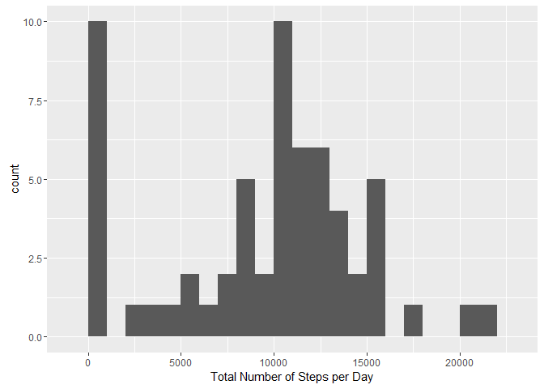
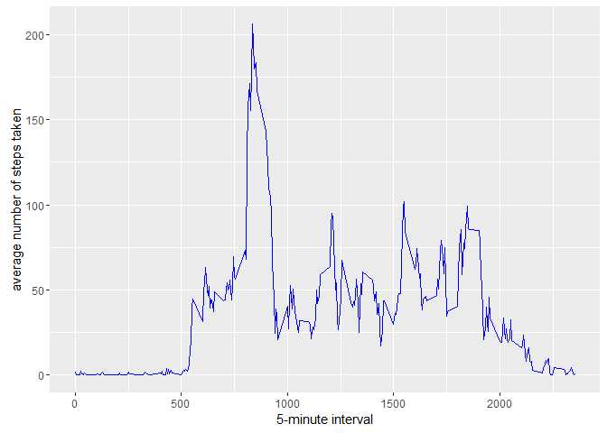
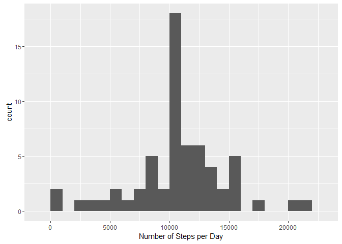
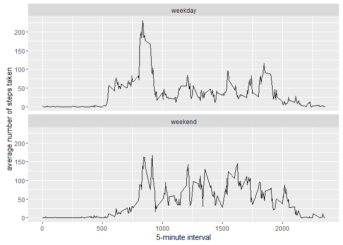

# Reproducible Research: Peer Assessment 1

#Introduction:

It is now possible to collect a large amount of data about personal movement using activity monitoring devices such as a [Fitbit](http://www.fitbit.com), [Nike Fuelband](http://www.nike.com/us/en_us/c/nikeplus-fuel), or [Jawbone Up](https://jawbone.com/up). These type of devices are part of the "quantified self" movement - a group of enthusiasts who take measurements about themselves regularly to improve their health, to find patterns in their behavior, or because they are tech geeks. But these data remain under-utilized both because the raw data are hard to obtain and there is a lack of statistical methods and software for processing and interpreting the data.

This assignment makes use of data from a personal activity monitoring device. This device collects data at 5 minute intervals through out the day. The data consists of two months of data from an anonymous individual collected during the months of October and November, 2012 and include the number of steps taken in 5 minute intervals each day.


##installing and loading required packages

```r
library(knitr)
library(rmarkdown)
opts_chunk$set(echo = TRUE)
library(dplyr)
```

```
## 
## Attaching package: 'dplyr'
```

```
## The following objects are masked from 'package:stats':
## 
##     filter, lag
```

```
## The following objects are masked from 'package:base':
## 
##     intersect, setdiff, setequal, union
```

```r
library(ggplot2)
```
## Loading and preprocessing the data

```r
unzip("activity.zip")
activity<- read.csv("activity.csv")
```
## What is mean total number of steps taken per day?


```r
number.steps<- tapply(activity$steps,activity$date,sum,na.rm=TRUE)
qplot(number.steps,binwidth=1000,xlab="Total Number of Steps per Day")
```



```r
mean(number.steps)
```

```
## [1] 9354.23
```

```r
median(number.steps)
```

```
## [1] 10395
```

## What is the average daily activity pattern?

```r
data<- aggregate(x=list(AvgSteps = activity$steps), by = list(Interval = activity$interval), FUN = "mean",na.rm=TRUE)
ggplot(data,aes(Interval,AvgSteps))+
list(geom_line(color = "blue"),
xlab("5-minute interval"),
ylab("average number of steps taken"))
```



```r
data[which.max(data$AvgSteps),]
```

```
##     Interval AvgSteps
## 104      835 206.1698
```
## Imputing missing values


```r
sum(is.na(activity$steps))
```

```
## [1] 2304
```

```r
newdata<- activity
nas<- is.na(newdata$steps)
avgs<- tapply(newdata$steps,newdata$interval,mean,na.rm=TRUE)
newdata$steps[nas]<- avgs[as.character(newdata$interval[nas])]
sum(is.na(newdata))
```

```
## [1] 0
```

```r
head(newdata)
```

```
##       steps       date interval
## 1 1.7169811 2012-10-01        0
## 2 0.3396226 2012-10-01        5
## 3 0.1320755 2012-10-01       10
## 4 0.1509434 2012-10-01       15
## 5 0.0754717 2012-10-01       20
## 6 2.0943396 2012-10-01       25
```

```r
stepsperday<- tapply(newdata$steps,newdata$date,sum,na.rm=TRUE)
qplot(stepsperday,binwidth=1000,xlab="Number of Steps per Day")
```



```r
mean(stepsperday)
```

```
## [1] 10766.19
```

```r
median(stepsperday)
```

```
## [1] 10766.19
```
The impact of imputing missing data with the average number of steps in the same 5-minute interval is that both the mean and median have the same value of 10766.19.

## Are there differences in activity patterns between weekdays and weekends?

For this part the weekdays() function may be of some help here. Use the dataset with the filled-in missing values for this part.

Create a new factor variable in the dataset with two levels - "weekday" and "weekend" indicating whether a given date is a weekday or weekend day.
Make a panel plot containing a time series plot (i.e. type = "l") of the 5-minute interval (x-axis) and the average number of steps taken, averaged across all weekday days or weekend days (y-axis). See the README file in the GitHub repository to see an example of what this plot should look like using simulated data.


```r
newdata$date <- as.Date(newdata$date)
weekdays1<- c('Monday','Tuesday','Wednesday','Thursday','Friday')
newdata$wDay<- factor((weekdays(newdata$date) %in% weekdays1),levels=c(FALSE,TRUE),
labels=c('weekend','weekday'))
newdata$wDay<- c('weekend','weekday')[(weekdays(newdata$date) %in% weekdays1)+1L]
Finaldata<- aggregate(x=list(steps = newdata$steps), by = list(interval= newdata$interval,wDay = newdata$wDay), FUN = "mean",na.rm=TRUE)
ggplot(Finaldata,aes(x=interval,y=steps))+
list(geom_line(),
facet_wrap(~wDay,ncol=1,nrow=2),
xlab("5-minute interval"),
ylab("average number of steps taken"))
```


